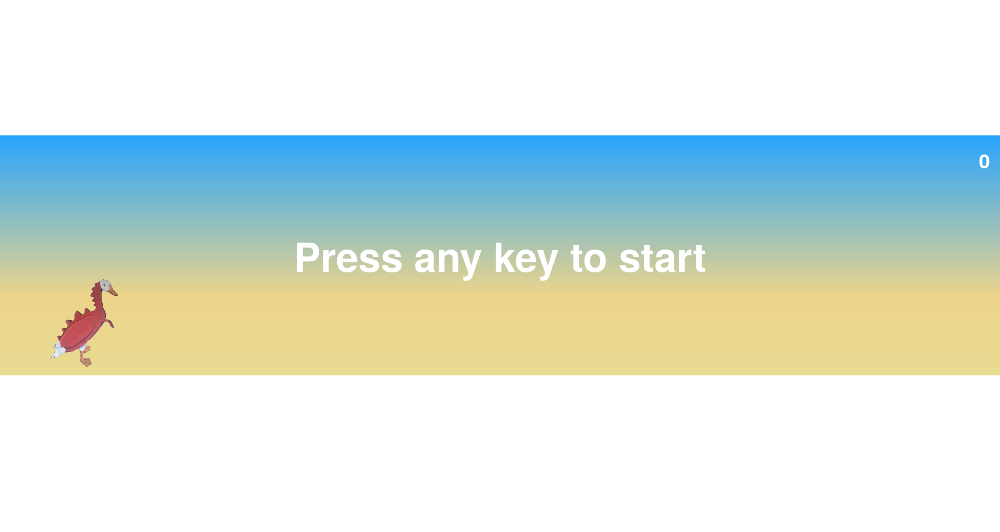

# Duckosaur

Duckosaur is a dino-like game, but it's a duck !



# Play

You can play the last stable version [here](https://duckosaur.harupi.me).

# Run it locally

If you want to run it locally, you can clone this repo by running the command ```git clone https://github.com/Hvrnbi/duckosaur``` in a terminal. (You need to install git first)

Now you just have to open the index.html file !

# Licensing

All rights for the player.gif file are reserved. Please do not use it in any way.
All the other files are under [MIT](https://github.com/Hvrnbi/elite-four/blob/main/LICENSE) license.

# Thanks

Thanks to my girlfriend and her roommates for drawing ducko and ~~forcing me~~ asking me politely to make this game.

## Support me

[](https://ko-fi.com/G5J5206K5C)
[](https://liberapay.com/Harupi/donate)
